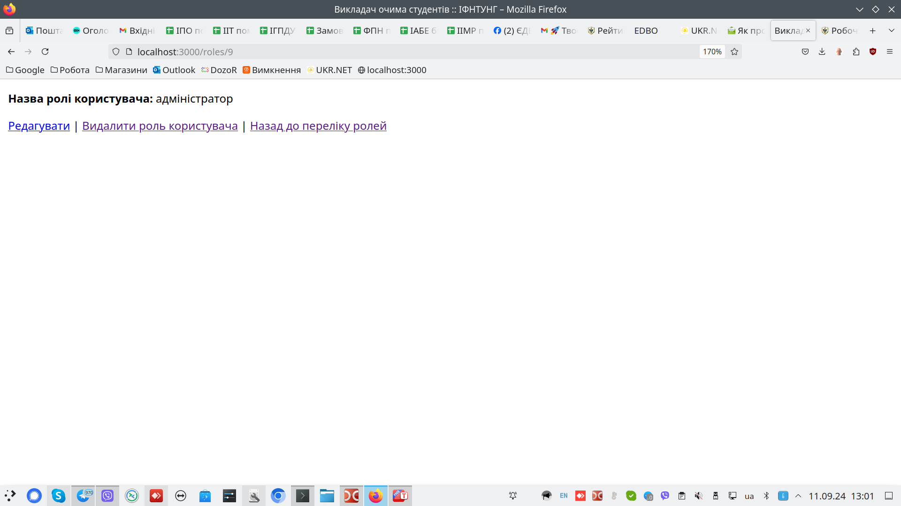
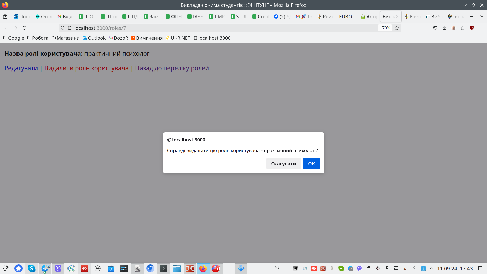

# README

КОМП’ЮТЕРНА ПРОГРАМА
“ВИКЛАДАЧ ОЧИМА СТУДЕНТІВ”

Призначення. Автоматизоване проведення соціологічного опитування «Викладач очима студентів», яке є важливою складовою системи забезпечення якості вищої освіти, передбаченої чинними нормативними актами.

Ролі користувачів:
- студент – оцінює роботу своїх викладачів за певними критеріями;
- викладач – переглядає зведену статистику оцінок від своїх студентів; 
- адміністратор – готує базу даних для опитування.

1. Вхід у програму

Для входу в програму необхідно в інтернет-браузері відкрити web-сайт соціологічного опитування за посиланням, наданим адміністратором:

Увійти в систему користувач може, використовуючи свій обліковий запис Google в домені закладу вищої освіти, надану адміністрацією закладу. Такий спосіб входу є конфіденційним, зручним і простим в реалізації, оскільки немає потреби створювати і використовувати традиційну громіздку та не вельми надійну систему захисту на основі логінів і паролів.

Після розпізнавання ролі користувача за ім’ям облікового запису система надає користувачу доступ до своїх функцій залежно від його ролі.

2. Роль «Студент»

Користувач з роллю студента, увійшовши в систему, бачить перелік своїх викладачів. Якщо натиснути на  «Критерії оцінювання та оцінки», можна оцінити викладачів за групою критеріїв. Для цього слід вибрати оцінку для кожного критерію з випадного списку:

Для того, щоби система зарахувала вибрані оцінки, необхідно натиснути кнопку «Підтвердити»:

Для завершення сеансу роботи необхідно натиснути на посилання «Вийти».

3. Роль «Викладач»

Користувач з роллю викладача, увійшовши в систему через свою корпоративну пошту, бачить кількість опитаних студентів, перелік критеріїв для оцінювання, суму набраних балів, середній бал, допустимий бал і частку набраних балів від максимально можливої кількості балів з кожного критерію і загалом:

Насамкінець унизу сторінки виведено загальний показник викладача за підсумками опитування. Цей показник вимірюють за шкалою від 0 ло 100. Він характеризує якість роботи викладача (більше – краще) з погляду студентів у цілому.

4. Роль «Адміністратор»

   Користувач з роллю адміністратора може створювати, переглядати і редагувати дані, необхідні для забезпечення належної роботи програми. Ці дані згруповано в панелі адміністратора за такими розділами:
- ролі користувачів;
- структура закладу вищої освіти (кафедри, навчально-наукові інститути, факультети, адміністрація);
- академічні групи;
- здобувачі освіти. 
- особовий склад академгруп;
- персонал ЗВО (науково-педагогічні працівники кафедр, директори навчально-наукових інститутів та адміністрація);
- особовий склад науково-педагогічних працівників (викладачів) кафедр;
- пари «студент-викладач» для опитування;
- критерії для оцінювання науково-педагогічних працівників.

Натиснувши на посилання в панелі адміністратора, користувач отримує доступ до відповідного довідника, в якому можна доповнювати, редагувати або видаляти з нього певні дані.

4.1. Робота з довідником «Ролі користувачів»

Роль користувача визначає дії, які користувач може робити в програмі, та частини бази даних, які йому доступні. У системі «Викладач очима студентів» для користувачів передбачено такі ролі:

1. Адміністратор.
2. Викдадач.
3. Студент.

   Важливо: перед внесенням змін у ролі користувачів потрібно узгодити ці дії з розробником програмного продукту, оскільки вони істотно впливають на роботу системи.

Адміністратор може переглядати перелік ролей, дізнатися докладніші відомості про вибрану роль, змінити назву ролі, видалити роль:

Також можна додати нову роль, натиснувши на «Додати роль користувача»:

Якшо користувач введе таку роль, яка вже є в системі, буде виведено відповідне повідомлення, і збереження буде заблоковано:

Коли натиснути на «Видалити роль користувача», система запитає підтвердження:

4.2. Робота з довідником «Структура закладу вищої освіти»

У цьому довіднику міститься інформація про структурні підрозділи закладу вищої освіти, а саме:

1. Вид структурного підрозділу (кафедра, інститут/факультет).
2. Назва структурного підрозділу.

Структурні підрозділи можна додавати, змінювати вид і назву, видаляти, а також переглядати їхній особовий склад (прізвище, ім’я та по батькові, корпоративні email’и):

Видалити структурний підрозділ можна лише тоді, коли в ньому немає жодної особи.

4.3. Робота з довідником «Академгрупи»

У цьому довіднику міститься інформація про академгрупи в закладі вищої освіти, а саме їхні шифри:

Академгрупи можна додавати, змінювати назву, видаляти, а також переглядати їхній студентський склад (прізвище, ім’я та по батькові, код навчання в ЄДЕБО, корпоративний email):

Видалити академгрупу можна лише тоді, коли в ній немає жодної особи.

4.4. Робота з довідником «Здобувачі освіти»

У цьому довіднику міститься така інформація про здобувачів освіти:
1. Прізвище, ім’я та по батькові (за наявності).
2. Код персони в Єдиній державній базі з питань освіти, необхідний для однозначної ідентифікації особи здобувача.

Рис. 16

Здобувачів можна додавати, видаляти, переглядати та змінювати прізвище, ім’я та по батькові, код персони в ЄДЕБО:

Рис. 17

У програмі також передбачено імпорт даних про здобувачів освіти з текстового файлу, отриманого шляхом експорту в CSV здобувачів у Єдиній державній електронної базі з питань освіти.

Рис. 18

Важливо: перед імпортуванням текстовий файл CSV необхідно відкрити в текстовому редакторі та натиснути Кодування > Зберегти як > UTF-8, а потім Файл > Зберегти:

Рис. 19

4.5. Робота з довідником «Особовий склад академгруп»
У цьому довіднику міститься розподіл здобувачів освіти за академгрупами з такими даними:
1. Посилання на студента з довідника здобувачів освіти.
2. Посилання на академгрупу з довідника академгруп.
3. Корпоративна адреса email у домені закладу вищої освіти.

Рис. 20

Корпоративний email містить ім’я, прізвище здобувача, шифр академгрупи латинкою. У разі збігу імені та прізвища в одній академгрупі до імені додаємо перші літери по батькові, а якщо й вони однакові, то неповторення забезпечуємо додаванням унікального коду навчальної картки здобувача в ЄДЕБО.

У цьому довіднику також є імпорт з текстового файлу CSV, який експортуємо з ЄДЕБО.

4.6. Робота з довідником «Персонал ЗВО»

У цьому довіднику міститься така інформація про викладачів ЗВО:
1. Прізвище, ім’я та по батькові (за наявності).
2. Корпоративна адреса email у домені ЗВО.
3. Наукові ідентифікатори ORCiD, Scopus AuthorID, WoS Researcher Id.

Рис. 21

Якщо натиснути на «Подробиці», можна буде редагувати та видаляти дані про викладачів:

Рис. 22

Також доступний	 імпорт даних про персонал з текстового файлу.

4.7. Робота з довідником «Особовий склад НПП кафедр»

У цьому довіднику міститься така інформація про науково-педагогічних працівників кафедр:

1. Посилання на кафедру з довідника «Структура ЗВО».
2. Посилання на особу викладача з довідника «Персонал ЗВО»

Рис. 23

Якщо натиснути на «Подробиці», можна буде редагувати та видаляти певну позицію розподілу:

Рис. 24

Також можна імпортувати розподіл викладачів за кафедрами з заздалегідь підготовленого текстового файлу.

4.8. Робота з довідником «Пари студент-викладач для опитування»

У цьому довіднику міститься така інформація:

1. Посилання на позиції розподілу студентів за академгрупами.
2. Посилання на позиції розподілу викладачів за кафедрами.
   
Рис. 25

Якщо натиснути на «Подробиці», можна буде редагувати та видаляти певну пару «Студент – Викладач»:

Рис. 26

Також можна імпортувати пари «студент-викладач» із заздалегідь підготовленого текстового файлу, який можна отримати, наприклад, на основі експорту з ПП Деканат+.

4.9. Робота з довідником «Критерії для оцінювання НПП»

У цьому довіднику міститься така інформація:

1. Назва критерію.
2. Шкала оцінювання.

Рис. 27

Якщо натиснути на «Подробиці», можна буде редагувати та видаляти певний критерій:

Рис. 28

Зазначимо, що у шкалі оцінювання кожного критерію повинна бути опція «Утримаюся», що дає можливість студенту не оцінювати викладача за цим критерієм або за всіма відразу та забезпечує свободу вибору, яка є основою вільного демократичного суспільства.

4.10. Створення опитування

Після того, як сформовано всі 9 довідників, адміністратор може створити матрицю опитування для кожного студента. Для цього слід перейти в довідник «Пари для опитування» і натиснути «Створити опитування».